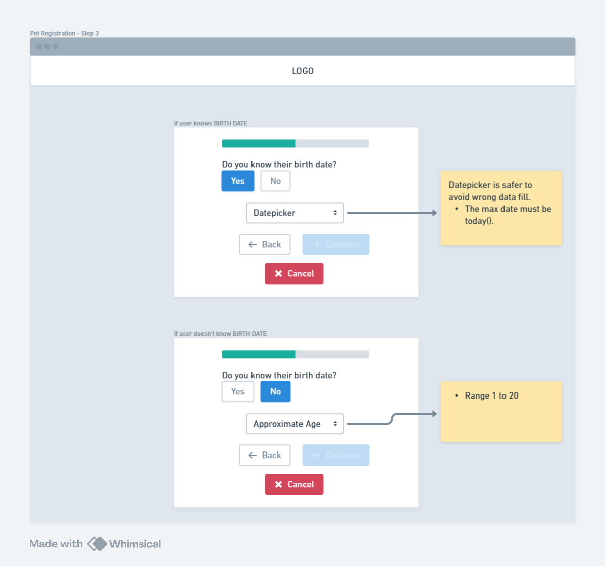
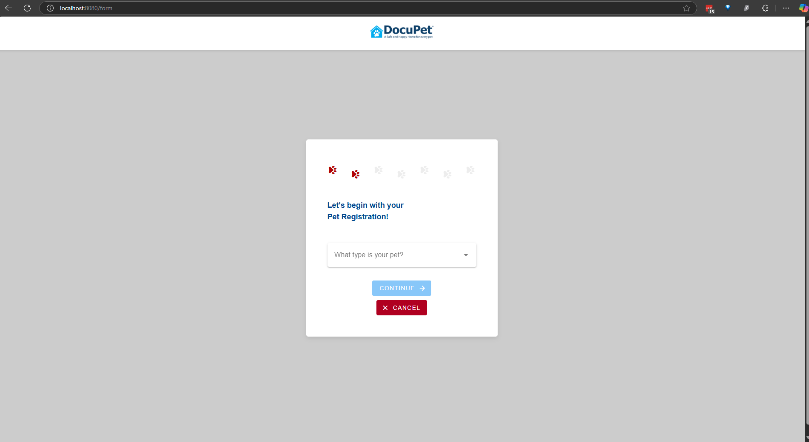
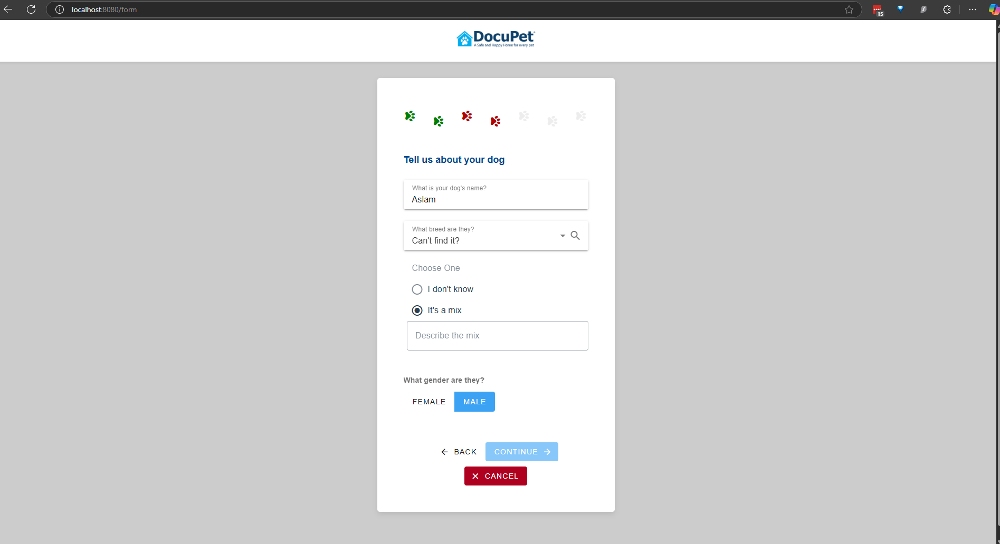

# DPET WEB APP

This is an app to Pet Registration using VueJS Framework (version 3) and Vuetify to components and styling. Integrated to the REST [DPET LARAVEL API](https://github.com/marinapelosi/dpet-laravel-api).

Please follow the instructions to install and using it.

# Undestanding

To have a succeed pet registration, we should understand all the concepts about this project.

## Features we have now

- Pet type listing
- Pet Registration

## Prototypes

Prototypes were created to support rule developments for the frontend.

### Pet List


### Pet Registration





----

## Getting Started

### Required

- Yarn
- Npm

```
git clone git@github.com:marinapelosi/dpet-web-app.git
```

```
cd dpet-web-app
```

```
yarn install
```

### Compiles and hot-reloads for development
```
npm run serve
```

WEB APP URL: http://localhost:8080

> To run you must have the REST API server up using http://localhost:8000 url.

> Auth no required.

-----

## Behaviour Screenshots

### Pet List


### Pet Registration Form






### Different labels/colors/icons depending on PetType and Breed


-----

Thank you
